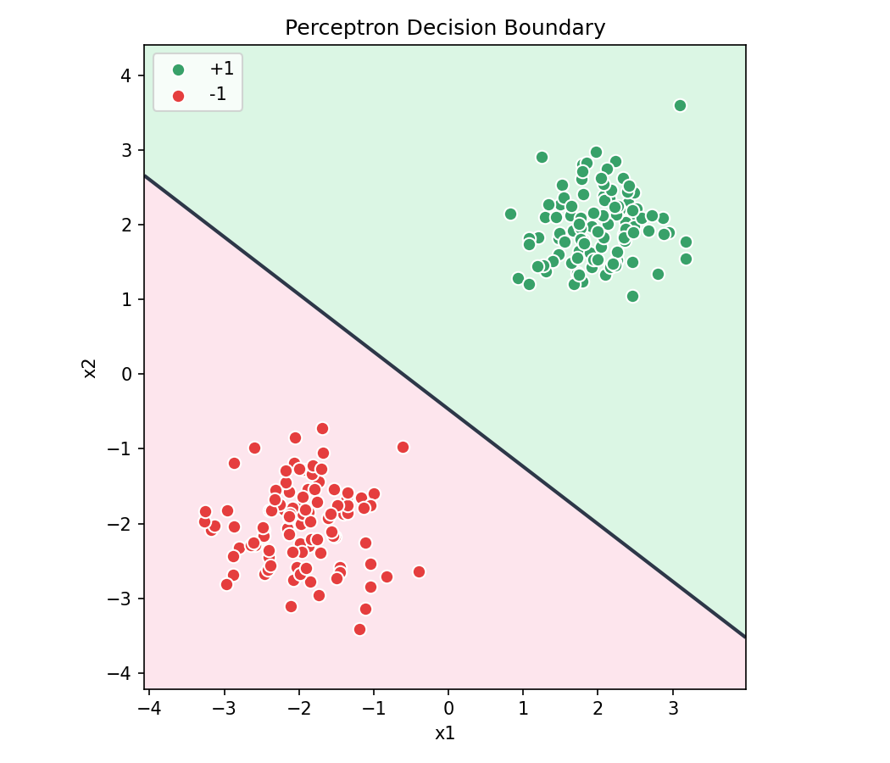
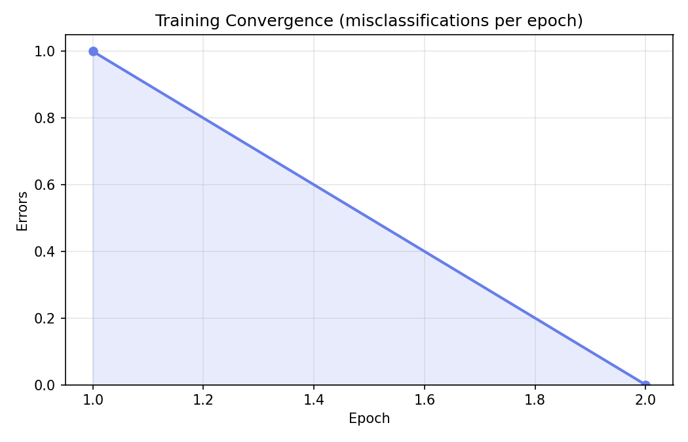

# T002 · 感知机（Perceptron）

> 状态：完成  
> 层级：Toy  
> 优先级：A-Core  
> 分类：02-传统机器学习  
> 路径：`02-传统机器学习(13)/T002-感知机-Perceptron/`

---

## 1. 问题定义

**要解决什么问题？**  
二维线性可分的二分类：给定特征 $x \in \mathbb{R}^2$ 与标签 $y \in \{-1,+1\}$，学习超平面 $w \cdot x + b = 0$，使训练样本被正确分开。

**输入 / 输出 / 成功标准**

| 项 | 说明 |
|----|------|
| 输入 | 2 维特征、±1 标签 |
| 输出 | 权重 $w$、偏置 $b$、预测标签 |
| 成功标准 | 线性可分 toy 数据上训练/测试准确率 = 100%，并画出决策边界与收敛曲线 |

---

## 2. 实验层级

**Toy** · 合成线性可分数据 · 纯 CPU · 零 GPU 成本

---

## 3. 实现

| 文件 | 作用 |
|------|------|
| `perceptron.py` | PLA 核心类：`fit` / `predict` / `score` |
| `train.py` | 造数 → 训练 → 评估 → 出图 → 写 `results.json` |
| `学习文档/` | 学习笔记（md + ipynb） |
| `figures/` | 决策边界、收敛曲线 |
| `results.json` | 指标快照 |

**算法**：Perceptron Learning Algorithm（PLA）

$$
\hat{y} = \mathrm{sign}(w \cdot x + b)
$$

错分时更新：

$$
w \leftarrow w + \eta\, y\, x,\quad b \leftarrow b + \eta\, y
$$

**依赖**：`numpy`、`matplotlib`、`scikit-learn`（仅 `train_test_split`）

**运行**：

```bash
cd 02-传统机器学习(13)/T002-感知机-Perceptron
python train.py
```

---

## 4. 数据

- **来源**：合成两类高斯簇（均值约 $[2,2]$ 与 $[-2,-2]$，`scale=0.55`），保证线性可分  
- **规模**：200 样本，train/test = 75% / 25%，`random_state=42`，分层划分  
- **标签约定**：`{-1, +1}`（不是 `{0,1}`）

---

## 5. 结果

| 指标 | 值 |
|------|-----|
| 训练准确率 | 100% |
| 测试准确率 | 100% |
| 实际 epoch | 2 |
| 权重更新次数 | 1 |
| 学习率 $\eta$ | 1.0 |
| 最终 $w$ | $\approx [1.634,\ 2.128]$ |
| 最终 $b$ | $1.0$ |

### 决策边界



### 收敛曲线



线性可分时 PLA 很快收敛到 0 错分，与 Novikoff 定理的「有限次更新」结论一致。

---

## 6. 复盘

**做对了什么**

- 标签严格用 ±1，避免更新符号错误  
- 数据主动保证可分，避免「永远不收敛」假失败  
- `sign(0)` 统一映射为 -1，消除边界点歧义  

**踩过的坑**

- `sklearn.make_classification(class_sep=1.0)` **不保证**线性可分；初版 100 epoch 仍 ~85% 准确率  
- 必须设 `max_epochs` 兜底，不可分时 PLA 不会停  

**记住的三件事**

1. 线性可分 → PLA 一定收敛  
2. 感知机 ≈ 逻辑回归去掉 sigmoid（硬分类 vs 概率）  
3. 多层感知机 = 感知机堆深度  

---

## 7. 下一步

- 把 `sign` 换成 `sigmoid` → 逻辑回归（见 T117）  
- 加隐藏层 → MLP  
- 不可分数据可试 Pocket 算法  

**完成判定**：代码可复现、指标达标、实验卡与图表齐全 → **完成**
